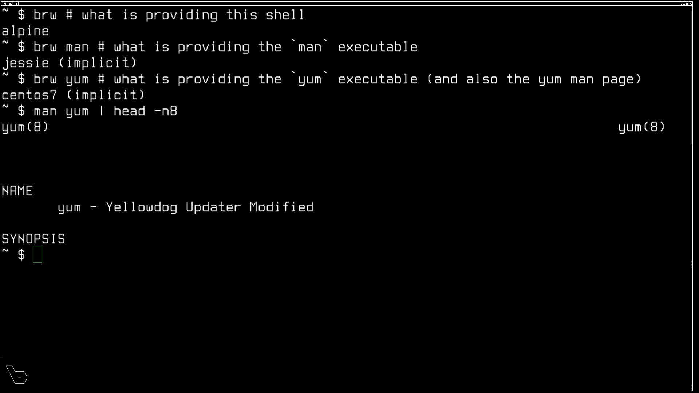

Title: Bedrock Linux 1.0beta2 Nyla Major Features
Nav: nyla.nav

Bedrock Linux 1.0beta2 Nyla Major Features
==========================================

- [New to Nyla](#new-to-nyla)
	- [Init](#init)
	- [Installation](#installation)
- [Preexisting Features](#preexisting)
	- [Executables](#executables)
	- [Man pages](#man-pages)
	- [Application menus](#application-menu)
	- [Icons](#icons)
- [Upcoming Features](#upcoming)

The typical explanation of Bedrock Linux:

> A Bedrock Linux system is composed of software gathered from other, normally
> mutually exclusive, Linux distributions, which are made to interact as though
> they were all intended for the same distribution.

is a bit abstract, which often leads to misunderstandings.  It may be best
explained with examples.  Below are some of the more noteworthy features of
Bedrock Linux as of 1.0beta2 Nyla which best illustrate what Bedrock Linux
does.

## {id="new-to-nyla"} New to Nyla

### {id="init"} Init system

Bedrock Linux can utilize any of a large number of init systems as provided by
other distributions: if there is a distro out there that provides an init
system you like, you're probably able to use it with Bedrock Linux.  Openrc
from Alpine or Gentoo, systemd from Centos or Debian or Arch, upstart from
Ubuntu LTS (for now), runit from Void Linux, BSD-style from Slackware or Crux,
etc.

After the bootloader prompt

> <small>Note this is Ubuntu's GRUB prompt - Ubuntu was *hijacked* for this
> example Bedrock Linux install</small>

Bedrock Linux provides another menu to choose which init system to use for the
given session.

Similar to most bootloader prompts, one can set a default and never see the
menu, as well as configure things such as a timer before it automatically
chooses the default.  Once a choice is made, Bedrock Linux does some prep work
then hands control of the session off to the specified init.

After that point the boot continues just as it normally would had that init
been the one native to the system.

This is not multiboot - you're not picking which OS to boot into.  Irrelevant
of which init was chosen, it's booting into the same OS - same users, same
packages installed, same configs, etc, as would be in place had any other init
been chosen at the previous menu.  Just a different init system is in use - one
that happens to be from another distro.

> <small>Ubuntu's desktop and terminal, Arch's package manager</small>

### {id="installation"} Installation

Some people prefer a polished, user-friendly installation experience which
abstracts away some of the gritty details underlying the installation process.
These people may choose a distro such as Ubuntu or Linux Mint.  Others prefer a
more hands-on approach and would choose something like Gentoo, Arch, or LFS.
Bedrock attempts to make all of these options available.

To install Bedrock Linux, one first installs another distro - Ubuntu, Mint,
Debian, Gentoo, Arch, CentOS etc - then *hijacks* it, converting it into a
Bedrock Linux system.  Installation steps such as partitioning, setting up a
bootloader, adding users, optionally setting up full disk encryption, etc, are
all done via another distro's tools and process - almost any major distro,
whichever the user would prefer.

This *hijack* installation process is new to the latest release and is, at the
moment, a somewhat manual process.  However, this release lays the groundwork
for future Bedrock Linux releases in which we may eventually distribute binary
packages.   These could be portable shell scripts, or if users find it easier,
they could be packaged natively to the about-to-be-hijacked distro and
distributed through something such as Ubuntu PPA's or Arch AUR.

Eventually, one will be able to install a distro whose installation
process/features is desirable, then trivially convert it into Bedrock Linux.

## {id="preexisting"} Preexisting Features

### {id="executables"} Executables

Bedrock Linux is able to utilize executables from other distributions such that
they largely "just work" as though they were all from the same distribution.
The executables can call each other, can all see the same general files, etc.

> <small>Three different package managers each install a different video
> player.  All of these different video players can be launched from the same
> shell, see the same video, etc - all working as though they were from the
> same distro.</small>

### {id="man-pages"} Man pages

A shell from one distro can call `man` from another which shows a man page from
yet a third - all interoperating as though they were intended for the same
distro.

> <small>Despite the fact that the shell is from Alpine Linux, the man
> executable is from Debian Jessie, and the man page is from Centos 7, all of
> these files "just work" together, largely indistinguishable from how they
> would have worked if they were intended for the same distro.</small>

### {id="application-menu"} Application menus

Many user-friendly-oriented distros provide a graphical menu which
lists/categorizes installed applications.  These menus are populated
automatically as new applications are added.  Under Bedrock Linux, the menu
items can be provided by different distros.  They'll all automatically show up
under the menu, just as they normally would if the application was native to
the same distro that provided the menu.  Clicking on the items launches them,
just as it should.

> <small>Despite the fact that SMplayer, Kaffeine and VLC are all from
> different distros, they all show up and "just work" from the Application
> menu.</small>

### {id="icons"} Icons

Typically, if a given distro is missing something such as icons in its
repository, this is not a huge problem - one can usually go get them elsewhere
and install them natively.  However, if another distro does provide the desired
icons, with Bedrock Linux, one can simply go get the icons from there, straight
from that package manager.

> <small>Arch provides the flattr icon themes, Debian provides the MATE icon
> theme, both show up in LXDE's icon theme chooser.</small>

## {id="upcoming"} Upcoming Features

To further cement the idea behind Bedrock Linux via examples, below are
features which are being worked toward for future releases.

While just about everything from one distro "just works" with other things from
that same distro, not everything "just works" works across distro boundaries.
Such things can be installed redundantly via package managers across distros
or, if they are unavailable in a given package manager / distro / repository,
they can be compiled from source, grabbed a theme online, etc.  Bedrock Linux
development is working towards minimizing such scenarios.  Various things being
pursued:

- Things which work in any one distro but do not "just work" across distros
  (but can be made to work with redundant package installs, some file copying /
  symlinks / etc):
    - Xorg fonts
    - Firmware
    - GUI toolkits themes (e.g. gtk themes)
    - Xorg session / Desktop Environment lists in Xorg login managers
- Heavily automated/easy hijack installation
- Automation to assist in bootstrapping package managers
- A package manager manager ("pmm") which can abstract away the different
  underlying package manager UIs as well as allow for things such as searching
  across package managers / repositories.
